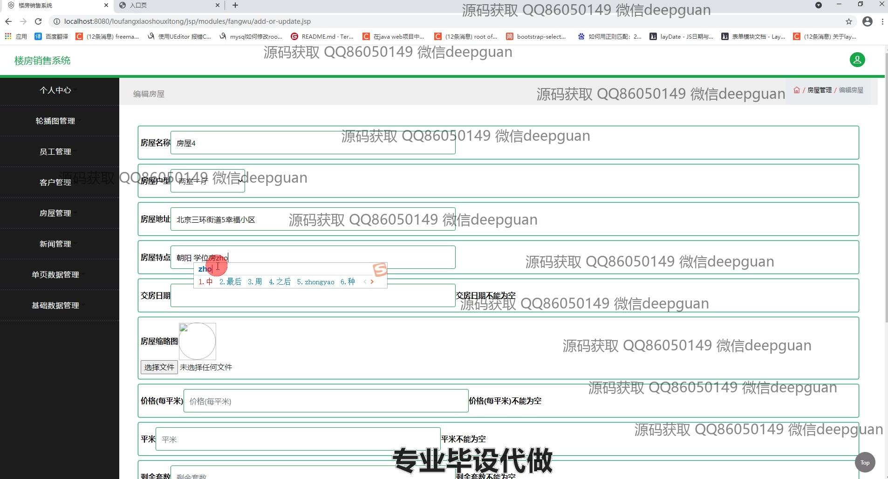
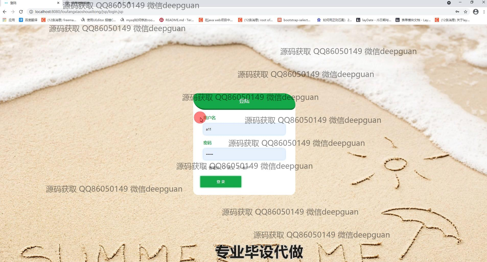

<h1 align="center">基于web的楼房销售系统</h1>

## 简介
楼房销售系统：角色分为管理员、用户；功能包括房屋管理、客户管理、员工管理、新闻管理、订单管理，支持用户进行房源查询、信息编辑、订单处理及用户信息管理。    --计算机毕业设计源码；毕设源码；java毕业设计源码

## 联系方式

<h3 align="center">获取完整代码与数据库文件 + 微信：deepguan QQ: 86050149 QQ群: 783742310</h3>

<h3 align="center">可帮忙远程部署 包运行成功！提供远程部署、修改代码、设计文档指导、代码讲解等服务！</h3>

## 功能介绍（完整见运行截图）
管理员：提供用户登录、注册、和退出功能，支持员工与客户的管理，包括添加、编辑、删除和查询功能。拥有房屋管理模块，允许上传房屋照片，设置房屋详情如名称、类型、地址、价格等，支持查看和管理房屋订单以及新闻内容，通过搜索和筛选功能辅以查询。通过导航栏访问个性化设置和基础数据的管理，维护系统内容的完整性和时效性。

用户：能够注册新账户和登录以获取完整功能，包括浏览房屋信息、提交购房意向、查看新闻动态及个人中心信息。首页提供房屋展示和详细信息查看，支持留言和订单管理。用户可以在个人中心更新自身信息，查看并管理收藏的房源及历史订单，通过留言和搜索功能与房屋相关信息进行交互，页面设计简洁以便于高效操作。

## 运行截图

本代码来源于网络,仅供学习参考使用!

